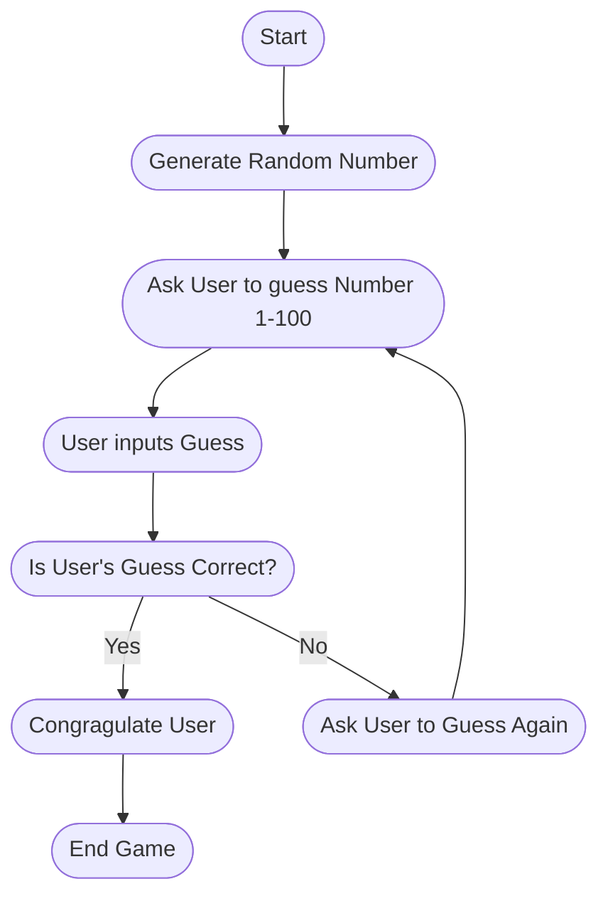

```mermaid
flowchart TD
Start([Start]) --> B([Generate Random Number])
B --> C([Ask User to guess Number 1-100])
C --> D([User inputs Guess])
D --> E([Is User's Guess Correct?])
E -- Yes --> F([Congragulate User])
E -- No --> G([Ask User to Guess Again])
G --> C
F --> H([End Game])
```

Program will Generate a Random Number 1-100
User will Guess their number
If User is correct game will End
If User is incorrect they must Guess Again

